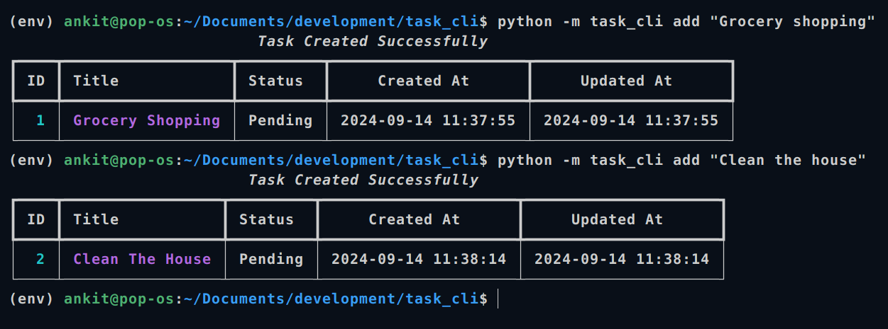
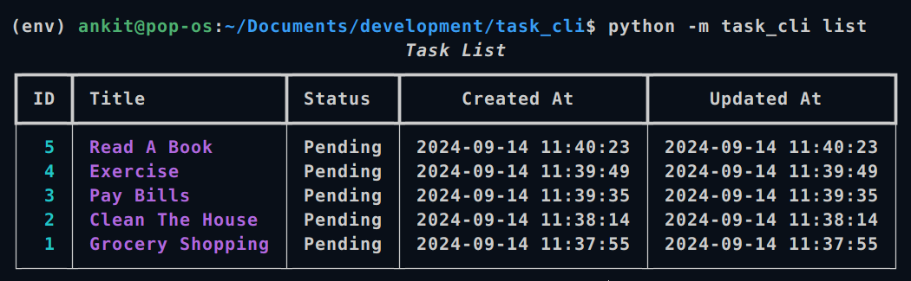
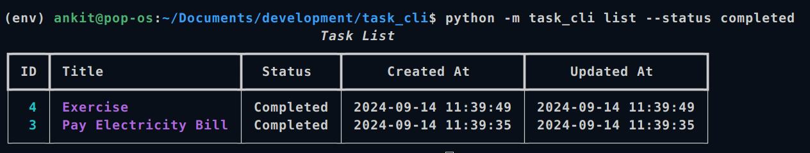
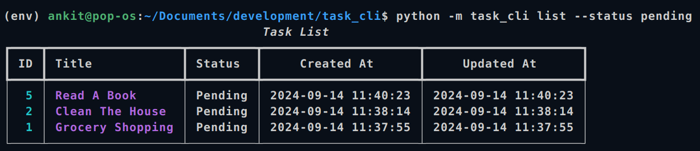
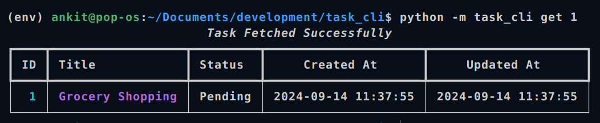
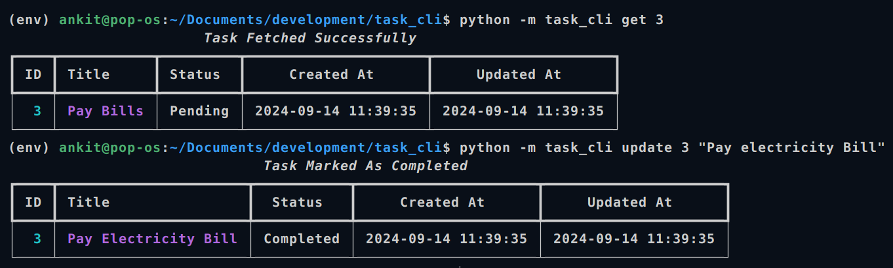
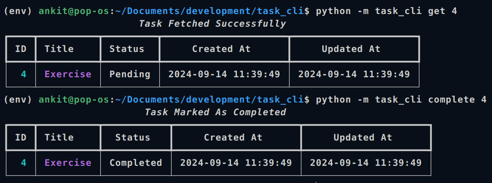
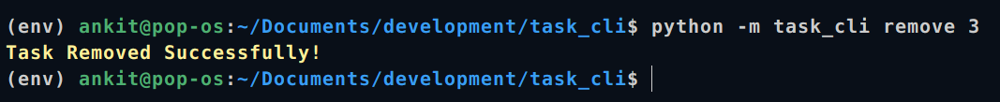

# Task Tracker

## Overview

Task-Tracker CLI is a simple command-line interface application for managing your tasks. With this tool, you can add, list, remove, get details, mark tasks as completed, and update tasks. It uses `typer` for command-line interaction and `rich` for stylish output and `sqlite` for stroing tasks.

## Features
- **Add Task:** Add a new task with a default status of "pending".
- **List Tasks:** View a list of tasks and also filter based on their status (pending, completed).
- **Update Task:** Update an existing task based on its ID.
- **Mark Task Status:** Change the status of a task to "in progress" or "done" based on its ID.
- **Delete Task:** Remove an existing task based on its ID.
- **Get Task:** Remove an existing task based on its ID.

## How to run

- Clone the repository and run the following command:

```sh
git clone https://github.com/ankitdevelops/Task-Tracker.git
cd Task-Tracker

# Run the following command to build and run the project:
pip install .

# command to list all the availabe commands
python -m task_cli --help

```

## Commands
Use the following commands to use the application.

### Add New Task
- Add a new task with a default status of "pending".
```sh 
python -m task_cli add "Read a book"
```



### List Tasks
- View a list of tasks and also filter based on their status (pending, completed).

```sh

# list all tasks
python -m task_cli list

# list completed tasks

python -m task_cli list --status completed

# list pending tasks
python -m task_cli list --status pending

```








### Get Task

- Read Single Task.

```sh

python -m task_cli get <task_id>

python -m task_cli get 3

```



### Update Task

- Update an existing task based on its ID

```sh

python -m task_cli update <task_id> <title>

python -m task_cli update 1 "Update task"

```




### Mark Complete

- Mark task as complete by id.

```
python -m task_cli complete <task_id>

python -m task_cli complete 2
```


### Remove

- Remove an existing task based on its ID.

```sh
python -m task_cli remove <task_id>

python -m task_cli remove 3
```




- This project is from [readmap.sh](https://roadmap.sh/projects/task-tracker). Check it out.